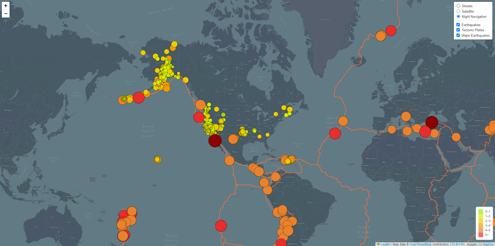

# Mapping_Earthquakes
[Mapping Earthquakes](./Earthquake_Challenge)
## Purpose
Create earthquake data in relation to tectonic plates' locations and include all earthquakes with a magnitude greater than 4.5, with adjusted corresponding colors for those earthquakes. Also include data in a third map.

### Tectonic Plate Data
Added tectonic plate data using d3.json(), added the data using the geoJSON() layer, set the tectonic plate LineString data to stand out on the map, and added the tectonic plate data to the overlay object with the earthquake data. Added color and set the radius of the circle markers based on the magnitude of earthquake.

### Major Earthquake Data
Using JavaScript, Leaflet.js, and geoJSON data, added major earthquake data to the map using d3.json(). Added a popup marker for each earthquake that displays the magnitude and location of the earthquake using the GeoJSON layer, geoJSON().

### Additional Map
Used JavaScript and Leaflet.js to add a third map style to the earthquake map.

